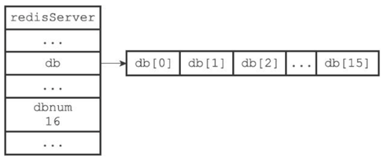

## 服务器中的数据库[^1]
Redis服务器将所有数据库都保存在服务器状态redis.h/redisServer结构的db数组中，db数组的每个项都是一个redis.h/redisDb结构，每个redisDb结构代表一个数据库：
```c
struct redisServer {
    // ...
    // 一个数组，保存着服务器中的所有数据库
    redisDb *db;
    // ...
};
```
在初始化服务器时，程序会根据服务器状态的dbnum属性来决定应该创建多少个数据库：
```c
struct redisServer {
    // ...
    // 服务器的数据库数量
    int dbnum;
    // ...
};
```
dbnum属性的值由服务器配置的database选项决定，默认情况下，该选项的值为16，所以Redis服务器默认会创建16个数据库。



## 切换数据库
默认情况下，Redis客户端的目标数据库为0号数据库，但客户端可以通过执行SELECT命令来切换目标数据库。

在服务器内部，客户端状态redisClient结构的db属性记录了客户端当前的目标数据库，这个属性是一个指向redisDb结构的指针：
```
typedef struct redisClient {
    // ...
    // 记录客户端当前正在使用的数据库
    redisDb *db;
    // ...
} redisClient;
```
redisClient.db指针指向redisServer.db数组的其中一个元素，而被指向的元素就是客户端的目标数据库。

## 数据库键空间
Redis是一个键值对（key-value pair）数据库服务器，服务器中的每个数据库都由一个redis.h/redisDb结构表示，其中，redisDb结构的dict字典保存了数据库中的所有键值对，我们将这个字典称为键空间（key space）：
```c
typedef struct redisDb {
    // ...
    // 数据库键空间，保存着数据库中的所有键值对
    dict *dict;
    // ...
} redisDb;
```
键空间和用户所见的数据库是直接对应的：
- 键空间的键也就是数据库的键，每个键都是一个字符串对象。
- 键空间的值也就是数据库的值，每个值可以是字符串对象、列表对象、哈希表对象、集合对象和有序集合对象中的任意一种Redis对象。

因为数据库的键空间是一个字典，所以所有针对数据库的操作，比如添加一个键值对到数据库，或者从数据库中删除一个键值对，又或者在数据库中获取某个键值对等，实际上都是通过对键空间字典进行操作来实现的。

### 读写键空间时的维护操作
当使用Redis命令对数据库进行读写时，服务器不仅会对键空间执行指定的读写操作，还会执行一些额外的维护操作，其中包括：
- 在读取一个键之后（读操作和写操作都要对键进行读取），服务器会根据键是否存在来更新服务器的键空间命中（hit）次数或键空间不命中（miss）次数，这两个值可以在INFO stats命令的keyspace_hits属性和keyspace_misses属性中查看。
- 在读取一个键之后，服务器会更新键的LRU（最后一次使用）时间，这个值可以用于计算键的闲置时间，使用OBJECT idletime命令可以查看键key的闲置时间。
- 如果服务器在读取一个键时发现该键已经过期，那么服务器会先删除这个过期键，然后才执行余下的其他操作，本章稍后对过期键的讨论会详细说明这一点。
- 如果有客户端使用WATCH命令监视了某个键，那么服务器在对被监视的键进行修改之后，会将这个键标记为脏（dirty），从而让事务程序注意到这个键已经被修改过。
- 服务器每次修改一个键之后，都会对脏（dirty）键计数器的值增1，这个计数器会触发服务器的持久化以及复制操作。
- 如果服务器开启了数据库通知功能，那么在对键进行修改之后，服务器将按配置发送相应的数据库通知，本章稍后讨论数据库通知功能的实现时会详细说明这一点。

## 设置键的生存时间或过期时间
通过EXPIRE命令或者PEXPIRE命令，客户端可以以秒或者毫秒精度为数据库中的某个键设置生存时间（Time To Live，TTL），在经过指定的秒数或者毫秒数之后，服务器就会自动删除生存时间为0的键。

### 设置过期时间
Redis有四个不同的命令可以用于设置键的生存时间（键可以存在多久）或过期时间（键什么时候会被删除）：
- EXPIRE＜key＞＜ttl＞命令用于将键key的生存时间设置为ttl秒。
- PEXPIRE＜key＞＜ttl＞命令用于将键key的生存时间设置为ttl毫秒。
- EXPIREAT＜key＞＜timestamp＞命令用于将键key的过期时间设置为timestamp所指定的秒数时间戳。
- PEXPIREAT＜key＞＜timestamp＞命令用于将键key的过期时间设置为timestamp所指定的毫秒数时间戳。

### 保存过期时间
redisDb结构的expires字典保存了数据库中所有键的过期时间，我们称这个字典为过期字典：
- 过期字典的键是一个指针，这个指针指向键空间中的某个键对象（也即是某个数据库键）。
- 过期字典的值是一个long long类型的整数，这个整数保存了键所指向的数据库键的过期时间——一个毫秒精度的UNIX时间戳。

### 移除过期时间
PERSIST命令就是PEXPIREAT命令的反操作：PERSIST命令在过期字典中查找给定的键，并解除键和值（过期时间）在过期字典中的关联。

### 过期键的判定
通过过期字典，程序可以用以下步骤检查一个给定键是否过期：
1. 检查给定键是否存在于过期字典：如果存在，那么取得键的过期时间。
2. 检查当前UNIX时间戳是否大于键的过期时间：如果是的话，那么键已经过期；否则的话，键未过期。

## 过期键删除策略
三种不同的删除策略：
- 定时删除：在设置键的过期时间的同时，创建一个定时器（timer），让定时器在键的过期时间来临时，立即执行对键的删除操作。
- 惰性删除：放任键过期不管，但是每次从键空间中获取键时，都检查取得的键是否过期，如果过期的话，就删除该键；如果没有过期，就返回该键。
- 定期删除：每隔一段时间，程序就对数据库进行一次检查，删除里面的过期键。至于要删除多少过期键，以及要检查多少个数据库，则由算法决定。

### 定时删除
定时删除策略对内存是最友好的：通过使用定时器，定时删除策略可以保证过期键会尽可能快地被删除，并释放过期键所占用的内存。 另一方面，定时删除策略的缺点是，它对CPU时间是最不友好的。 

除此之外，创建一个定时器需要用到Redis服务器中的时间事件，而当前时间事件的实现方式——无序链表，查找一个事件的时间复杂度为O（N）——并不能高效地处理大量时间事件。

### 惰性删除
惰性删除策略对CPU时间来说是最友好的：程序只会在取出键时才对键进行过期检查，这可以保证删除过期键的操作只会在非做不可的情况下进行，并且删除的目标仅限于当前处理的键，这个策略不会在删除其他无关的过期键上花费任何CPU时间。

惰性删除策略的缺点是，它对内存是最不友好的：如果一个键已经过期，而这个键又仍然保留在数据库中，那么只要这个过期键不被删除，它所占用的内存就不会释放。

在使用惰性删除策略时，如果数据库中有非常多的过期键，而这些过期键又恰好没有被访问到的话，那么它们也许永远也不会被删除（除非用户手动执行FLUSHDB），我们甚至可以将这种情况看作是一种内存泄漏——无用的垃圾数据占用了大量的内存。

### 定期删除
从上面对定时删除和惰性删除的讨论来看，这两种删除方式在单一使用时都有明显的缺陷：
- 定时删除占用太多CPU时间，影响服务器的响应时间和吞吐量。
- 惰性删除浪费太多内存，有内存泄漏的危险。

定期删除策略是前两种策略的一种整合和折中：
- 定期删除策略每隔一段时间执行一次删除过期键操作，并通过限制删除操作执行的时长和频率来减少删除操作对CPU时间的影响。
- 除此之外，通过定期删除过期键，定期删除策略有效地减少了因为过期键而带来的内存浪费。

定期删除策略的难点是确定删除操作执行的时长和频率：
- 如果删除操作执行得太频繁，或者执行的时间太长，定期删除策略就会退化成定时删除策略，以至于将CPU时间过多地消耗在删除过期键上面。
- 如果删除操作执行得太少，或者执行的时间太短，定期删除策略又会和惰性删除策略一样，出现浪费内存的情况。

因此，如果采用定期删除策略的话，服务器必须根据情况，合理地设置删除操作的执行时长和执行频率。

## Redis的过期键删除策略
Redis服务器实际使用的是**惰性删除**和**定期删除**两种策略：通过配合使用这两种删除策略，服务器可以很好地在合理使用CPU时间和避免浪费内存空间之间取得平衡。

### 惰性删除策略的实现
过期键的惰性删除策略由db.c/expireIfNeeded函数实现，所有读写数据库的Redis命令在执行之前都会调用expireIfNeeded函数对输入键进行检查：
- 如果输入键已经过期，那么expireIfNeeded函数将输入键从数据库中删除。
- 如果输入键未过期，那么expireIfNeeded函数不做动作。

### 定期删除策略的实现
过期键的定期删除策略由redis.c/activeExpireCycle函数实现，每当Redis的服务器周期性操作redis.c/serverCron函数执行时，activeExpireCycle函数就会被调用，它在规定的时间内，分多次遍历服务器中的各个数据库，从数据库的expires字典中随机检查一部分键的过期时间，并删除其中的过期键。

整个过程可以用伪代码描述如下：
```c
#默认每次检查的数据库数量
DEFAULT_DB_NUMBERS = 16
#默认每个数据库检查的键数量
DEFAULT_KEY_NUMBERS = 20
#全局变量，记录检查进度
current_db = 0
def activeExpireCycle():
    #初始化要检查的数据库数量
    #如果服务器的数据库数量比 DEFAULT_DB_NUMBERS要小
    #那么以服务器的数据库数量为准
    if server.dbnum ＜ DEFAULT_DB_NUMBERS:
        db_numbers = server.dbnum
    else:
        db_numbers = DEFAULT_DB_NUMBERS
    #遍历各个数据库
    for i in range(db_numbers):
        #如果current_db的值等于服务器的数据库数量
        #这表示检查程序已经遍历了服务器的所有数据库一次
        #将current_db重置为0，开始新的一轮遍历
        if current_db == server.dbnum:
            current_db = 0
        #获取当前要处理的数据库
        redisDb = server.db[current_db]
        #将数据库索引增1，指向下一个要处理的数据库
        current_db += 1
        #检查数据库键
        for j in range(DEFAULT_KEY_NUMBERS):
            #如果数据库中没有一个键带有过期时间，那么跳过这个数据库
            if redisDb.expires.size() == 0: break
            #随机获取一个带有过期时间的键
            key_with_ttl = redisDb.expires.get_random_key()
            #检查键是否过期，如果过期就删除它
            if is_expired(key_with_ttl):
                delete_key(key_with_ttl)
            #已达到时间上限，停止处理
            if reach_time_limit(): return
```

activeExpireCycle函数的工作模式可以总结如下：
- 函数每次运行时，都从一定数量的数据库中取出一定数量的随机键进行检查，并删除其中的过期键。
- 全局变量current_db会记录当前activeExpireCycle函数检查的进度，并在下一次activeExpireCycle函数调用时，接着上一次的进度进行处理。
- 随着activeExpireCycle函数的不断执行，服务器中的所有数据库都会被检查一遍，这时函数将current_db变量重置为0，然后再次开始新一轮的检查工作。

## AOF、RDB和复制功能对过期键的处理

### 生成RDB文件
在执行SAVE命令或者BGSAVE命令创建一个新的RDB文件时，程序会对数据库中的键进行检查，已过期的键不会被保存到新创建的RDB文件中。

### 载入RDB文件
在启动Redis服务器时，如果服务器开启了RDB功能，那么服务器将对RDB文件进行载入：
- 如果服务器以主服务器模式运行，那么在载入RDB文件时，程序会对文件中保存的键进行检查，未过期的键会被载入到数据库中，而过期键则会被忽略，所以过期键对载入RDB文件的主服务器不会造成影响。
- 如果服务器以从服务器模式运行，那么在载入RDB文件时，文件中保存的所有键，不论是否过期，都会被载入到数据库中。不过，因为主从服务器在进行数据同步的时候，从服务器的数据库就会被清空，所以一般来讲，过期键对载入RDB文件的从服务器也不会造成影响。

### AOF文件写入
当服务器以AOF持久化模式运行时，如果数据库中的某个键已经过期，但它还没有被惰性删除或者定期删除，那么AOF文件不会因为这个过期键而产生任何影响。当过期键被惰性删除或者定期删除之后，程序会向AOF文件追加（append）一条DEL命令，来显式地记录该键已被删除。

### AOF重写
和生成RDB文件时类似，在执行AOF重写的过程中，程序会对数据库中的键进行检查，已过期的键不会被保存到重写后的AOF文件中。

### 复制
当服务器运行在复制模式下时，从服务器的过期键删除动作由主服务器控制：
- 主服务器在删除一个过期键之后，会显式地向所有从服务器发送一个DEL命令，告知从服务器删除这个过期键。
- 从服务器在执行客户端发送的读命令时，即使碰到过期键也不会将过期键删除，而是继续像处理未过期的键一样来处理过期键。❑从服务器只有在接到主服务器发来的DEL命令之后，才会删除过期键。

通过由主服务器来控制从服务器统一地删除过期键，可以保证主从服务器数据的一致性，也正是因为这个原因，当一个过期键仍然存在于主服务器的数据库时，这个过期键在从服务器里的复制品也会继续存在。

## 重点回顾
- Redis服务器的所有数据库都保存在redisServer.db数组中，而数据库的数量则由redisServer.dbnum属性保存。
- 客户端通过修改目标数据库指针，让它指向redisServer.db数组中的不同元素来切换不同的数据库。
- 数据库主要由dict和expires两个字典构成，其中dict字典负责保存键值对，而expires字典则负责保存键的过期时间。
- 因为数据库由字典构成，所以对数据库的操作都是建立在字典操作之上的。
- 数据库的键总是一个字符串对象，而值则可以是任意一种Redis对象类型，包括字符串对象、哈希表对象、集合对象、列表对象和有序集合对象，分别对应字符串键、哈希表键、集合键、列表键和有序集合键。❑expires字典的键指向数据库中的某个键，而值则记录了数据库键的过期时间，过期时间是一个以毫秒为单位的UNIX时间戳。
- Redis使用惰性删除和定期删除两种策略来删除过期的键：惰性删除策略只在碰到过期键时才进行删除操作，定期删除策略则每隔一段时间主动查找并删除过期键。
- 执行SAVE命令或者BGSAVE命令所产生的新RDB文件不会包含已经过期的键。
- 执行BGREWRITEAOF命令所产生的重写AOF文件不会包含已经过期的键。
- 当一个过期键被删除之后，服务器会追加一条DEL命令到现有AOF文件的末尾，显式地删除过期键。
- 当主服务器删除一个过期键之后，它会向所有从服务器发送一条DEL命令，显式地删除过期键。
- 从服务器即使发现过期键也不会自作主张地删除它，而是等待主节点发来DEL命令，这种统一、中心化的过期键删除策略可以保证主从服务器数据的一致性。
- 当Redis命令对数据库进行修改之后，服务器会根据配置向客户端发送数据库通知。

[^1]:《Redis设计与实现》
