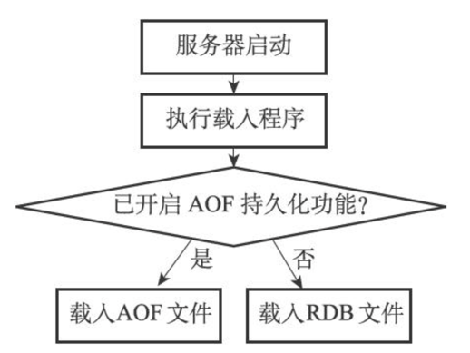

# Redis RDB持久化


Redis是一个键值对数据库服务器，服务器中通常包含着任意个非空数据库，而每个非空数据库中又可以包含任意个键值对，为了方便起见，我们将服务器中的非空数据库以及它们的键值对统称为数据库状态。

因为Redis是内存数据库，它将自己的数据库状态储存在内存里面，所以如果不想办法将储存在内存中的数据库状态保存到磁盘里面，那么一旦服务器进程退出，服务器中的数据库状态也会消失不见。为了解决这个问题，Redis提供了RDB持久化功能，这个功能可以将Redis在内存中的数据库状态保存到磁盘里面，避免数据意外丢失。

RDB持久化既可以手动执行，也可以根据服务器配置选项定期执行，该功能可以将某个时间点上的数据库状态保存到一个RDB文件中。

RDB持久化功能所生成的RDB文件是一个经过压缩的二进制文件，通过该文件可以还原生成RDB文件时的数据库状态。 因为RDB文件是保存在硬盘里面的，所以即使Redis服务器进程退出，甚至运行Redis服务器的计算机停机，但只要RDB文件仍然存在，Redis服务器就可以用它来还原数据库状态。

## RDB文件的创建与载入[^1]
有两个Redis命令可以用于生成RDB文件，一个是`SAVE`，另一个是`BGSAVE`。SAVE命令会阻塞Redis服务器进程，直到RDB文件创建完毕为止，在服务器进程阻塞期间，服务器不能处理任何命令请求；BGSAVE命令会派生出一个子进程，然后由子进程负责创建RDB文件，服务器进程（父进程）继续处理命令请求。

创建RDB文件的实际工作由`rdb.c/rdbSave`函数完成，SAVE命令和BGSAVE命令会以不同的方式调用这个函数，通过以下伪代码可以明显地看出这两个命令之间的区别：
```python
def SAVE():
    #创建RDB文件
    rdbSave()
def BGSAVE():
    #创建子进程
    pid = fork()
    if pid == 0:
        #子进程负责创建RDB文件
        rdbSave()
        #完成之后向父进程发送信号
        signal_parent()
    elif pid ＞ 0:
        #父进程继续处理命令请求，并通过轮询等待子进程的信号
        handle_request_and_wait_signal()
    else:
        #处理出错情况
        handle_fork_error()
```

RDB文件的载入工作是在服务器启动时自动执行的，所以Redis并没有专门用于载入RDB文件的命令，只要Redis服务器在启动时检测到RDB文件存在，它就会自动载入RDB文件。

另外值得一提的是，因为AOF文件的更新频率通常比RDB文件的更新频率高，所以：
- 如果服务器开启了AOF持久化功能，那么服务器会优先使用AOF文件来还原数据库状态。
- 只有在AOF持久化功能处于关闭状态时，服务器才会使用RDB文件来还原数据库状态。



### SAVE命令执行时的服务器状态
当SAVE命令执行时，Redis服务器会被阻塞，所以当SAVE命令正在执行时，客户端发送的所有命令请求都会被拒绝。只有在服务器执行完SAVE命令、重新开始接受命令请求之后，客户端发送的命令才会被处理。

### BGSAVE命令执行时的服务器状态
因为BGSAVE命令的保存工作是由子进程执行的，所以在子进程创建RDB文件的过程中，Redis服务器仍然可以继续处理客户端的命令请求，但是，在BGSAVE命令执行期间，服务器处理SAVE、BGSAVE、BGREWRITEAOF三个命令的方式会和平时有所不同。
- 首先，在BGSAVE命令执行期间，客户端发送的SAVE命令会被服务器拒绝，服务器禁止SAVE命令和BGSAVE命令同时执行是为了避免父进程（服务器进程）和子进程同时执行两个rdbSave调用，防止产生竞争条件。
- 其次，在BGSAVE命令执行期间，客户端发送的BGSAVE命令会被服务器拒绝，因为同时执行两个BGSAVE命令也会产生竞争条件。
- 最后，BGREWRITEAOF和BGSAVE两个命令不能同时执行：
  - 如果BGSAVE命令正在执行，那么客户端发送的BGREWRITEAOF命令会被延迟到BGSAVE命令执行完毕之后执行。
  - 如果BGREWRITEAOF命令正在执行，那么客户端发送的BGSAVE命令会被服务器拒绝。

因为BGREWRITEAOF和BGSAVE两个命令的实际工作都由子进程执行，所以这两个命令在操作方面并没有什么冲突的地方，不能同时执行它们只是一个性能方面的考虑——并发出两个子进程，并且这两个子进程都同时执行大量的磁盘写入操作，这怎么想都不会是一个好主意。

### RDB文件载入时的服务器状态
服务器在载入RDB文件期间，会一直处于阻塞状态，直到载入工作完成为止。

## 自动间隔性保存
因为BGSAVE命令可以在不阻塞服务器进程的情况下执行，所以Redis允许用户通过设置服务器配置的save选项，让服务器每隔一段时间自动执行一次BGSAVE命令。用户可以通过save选项设置多个保存条件，但只要其中任意一个条件被满足，服务器就会执行BGSAVE命令。

举个例子，如果我们向服务器提供以下配置：
```
save 900 1
save 300 10
save 60 10000
```

那么只要满足以下三个条件中的任意一个，BGSAVE命令就会被执行：
- 服务器在900秒之内，对数据库进行了至少1次修改。
- 服务器在300秒之内，对数据库进行了至少10次修改。
- 服务器在60秒之内，对数据库进行了至少10000次修改。

### 设置保存条件
当Redis服务器启动时，用户可以通过指定配置文件或者传入启动参数的方式设置save选项，如果用户没有主动设置save选项，那么服务器会为save选项设置默认条件。服务器程序会根据save选项所设置的保存条件，设置服务器状态redisServer结构的saveparams属性：
```c
struct redisServer {
  // ...
  //记录了保存条件的数组
  struct saveparam *saveparams;
  // ...
};
```

### dirty计数器和lastsave属性
除了saveparams数组之外，服务器状态还维持着一个dirty计数器，以及一个lastsave属性：
- dirty计数器记录距离上一次成功执行SAVE命令或者BGSAVE命令之后，服务器对数据库状态（服务器中的所有数据库）进行了多少次修改（包括写入、删除、更新等操作）。
- lastsave属性是一个UNIX时间戳，记录了服务器上一次成功执行SAVE命令或者BGSAVE命令的时间。
```c
struct redisServer {
    // ...
    //修改计数器
    long long dirty;
    //上一次执行保存的时间
    time_t lastsave;
    // ...
};
```

### 检查保存条件是否满足
Redis的服务器周期性操作函数serverCron默认每隔100毫秒就会执行一次，该函数用于对正在运行的服务器进行维护，它的其中一项工作就是检查save选项所设置的保存条件是否已经满足，如果满足的话，就执行BGSAVE命令。

```python
def serverCron():
    # ...
    #遍历所有保存条件
    for saveparam in server.saveparams:
        #计算距离上次执行保存操作有多少秒
        save_interval = unixtime_now()-server.lastsave
        #如果数据库状态的修改次数超过条件所设置的次数
        #并且距离上次保存的时间超过条件所设置的时间
        #那么执行保存操作
        if server.dirty ＞= saveparam.changes and \
           save_interval ＞ saveparam.seconds:
            BGSAVE()
    # ...
```
程序会遍历并检查saveparams数组中的所有保存条件，只要有任意一个条件被满足，那么服务器就会执行BGSAVE命令。

## RDB文件结构
一个完整的RDB文件包含以下几个部分：
```shell
| REDIS | db_version | databases | EOF | check_sum |
```
其中：
- RDB文件的最开头是REDIS部分，这个部分的长度为5字节，保存着“REDIS”五个字符。通过这五个字符，程序可以在载入文件时，快速检查所载入的文件是否RDB文件。
- db_version长度为4字节，它的值是一个字符串表示的整数，这个整数记录了RDB文件的版本号，比如&#34;0006&#34;就代表RDB文件的版本为第六版
- databases部分包含着零个或任意多个数据库，以及各个数据库中的键值对数据。
- EOF常量的长度为1字节，这个常量标志着RDB文件正文内容的结束，当读入程序遇到这个值的时候，它知道所有数据库的所有键值对都已经载入完毕了。
- check_sum是一个8字节长的无符号整数，保存着一个校验和，这个校验和是程序通过对REDIS、db_version、databases、EOF四个部分的内容进行计算得出的。

### databases部分
一个RDB文件的databases部分可以保存任意多个非空数据库。每个非空数据库在RDB文件中都可以保存为SELECTDB、db_number、key_value_pairs三个部分：
```shell
| SELECTDB | db_number | key_value_pairs |
```

### key_value_pairs部分
RDB文件中的每个key_value_pairs部分都保存了一个或以上数量的键值对，如果键值对带有过期时间的话，那么键值对的过期时间也会被保存在内。不带过期时间的键值对在RDB文件中由TYPE、key、value三部分组成：
```shell
| TYPE | key | value |
```
TYPE记录了value的类型，长度为1字节，每个TYPE常量都代表了一种对象类型或者底层编码，当服务器读入RDB文件中的键值对数据时，程序会根据TYPE的值来决定如何读入和解释value的数据。Type的值可以是以下常量的其中一个：
- REDIS_RDB_TYPE_STRING
- REDIS_RDB_TYPE_LIST
- REDIS_RDB_TYPE_SET
- REDIS_RDB_TYPE_ZSET
- REDIS_RDB_TYPE_HASH
- REDIS_RDB_TYPE_LIST_ZIPLIST
- REDIS_RDB_TYPE_SET_INTSET
- REDIS_RDB_TYPE_ZSET_ZIPLIST
- REDIS_RDB_TYPE_HASH_ZIPLIST

带有过期时间的键值对在RDB文件中的结构：
```shell
| EXPIRETIME_MS | ms | TYPE | key | value |
```
其中，
- EXPIRETIME_MS常量的长度为1字节，它告知读入程序，接下来要读入的将是一个以毫秒为单位的过期时间。
- ms是一个8字节长的带符号整数，记录着一个以毫秒为单位的UNIX时间戳，这个时间戳就是键值对的过期时间。

### value的编码
RDB文件中的每个value部分都保存了一个值对象，每个值对象的类型都由与之对应的TYPE记录，根据类型的不同，value部分的结构、长度也会有所不同。

## 分析RDB文件
我们可以使用od命令来分析Redis服务器产生的RDB文件，该命令可以用给定的格式转存（dump）并打印输入文件。

## 重点回顾
- RDB文件用于保存和还原Redis服务器所有数据库中的所有键值对数据。
- SAVE命令由服务器进程直接执行保存操作，所以该命令会阻塞服务器。
- BGSAVE令由子进程执行保存操作，所以该命令不会阻塞服务器。
- 服务器状态中会保存所有用save选项设置的保存条件，当任意一个保存条件被满足时，服务器会自动执行BGSAVE命令。
- RDB文件是一个经过压缩的二进制文件，由多个部分组成。
- 对于不同类型的键值对，RDB文件会使用不同的方式来保存它们。

[^1]: 《Redis设计与实现》


---

> 作者:   
> URL: https://xzygis.github.io/posts/introduction-to-redis-rdb-persistence/  

