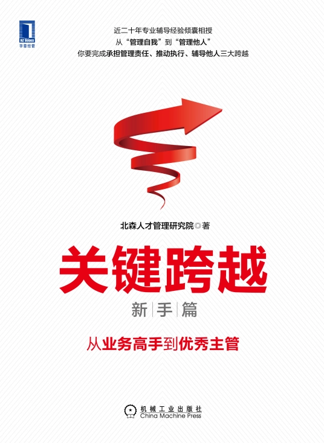

# 《关键跨越：从业务高手到优秀主管》：最大化团队产出

> 作者：北森人才管理研究院
阅读时长：6小时21分钟
评分：5星+

> 失控最鲜明的特征之一是管理者工作的时间越来越长，但结果越来越糟。很多新手管理者看到下属无法完成任务，或者担心出错，对下属不放心，出于对效率和成果的考量，会索性选择自己上手干。管理者事必躬亲，在执行性工作上投入大量时间，会渐渐发现自己每天都有做不完的事情。

本书重点介绍的是从“管理自我”到“管理他人”的关键跨越，也是刚开始做管理工作的新手管理者需要具备的关键能力。旨在帮助新手管理者：第一，聚焦发展目标；第二，简化发展路径；第三，找到切实可行的工作方法。
本书主要围绕三个关键跨越进行展开：（1）承担管理责任；（2）推动执行；（3）辅导他人。

## 承担管理责任
第一个管理责任是表率垂范，它要求我们以身作则，要求下属做到的，首先自己要做到，而且要做得更好。此外，还要求我们身先士卒，遇到困难时要冲在前面，为下属解决难题。
第二个管理责任是为结果负责。为结果负责包括为所做决定负责和为团队的工作结果负责。要做到为决定负责，得学会适应两个常态：一是会犯错，二是不能两全其美。为团队的工作结果负责要区分“好”的和“坏”的结果。取得坏结果时要帮团队“背锅”，取得好结果时则要把舞台和聚光灯留给下属。
第三个管理责任是组织意识，要遵守和代表组织的规则。

## 推动执行
作为管理者的推动执行能力和作为个人贡献者的高效执行能力并不能画等号，管理者要以最大化团队产出为目标。
哪些事情可以最大化团队产出？（1）目标设定。管理者需要在职责范围内向团队成员明确传递哪些目标是更重要的，合理投入自己和团队的精力，而不是平均用力去完成上级布置的所有工作。（2）任务分配。管理者需要把紧急程度不同和难度不同的工作任务，根据员工的特点合理进行分配，并与下属就工作任务的成功标准和时间要求达成共识。（3）过程管理。管理者需要认识到，同样的工作，由他人来完成比由自己完成更不可控的现实，并能够采取必要措施，保证团队工作的进度和质量。（4）应对变化。根据实际情况动态调整团队的工作计划，在充满变化的环境中主动管理变化而不是被动应付，这是管理者的必修课。（5）总结复盘。管理者不能停留在遇到一个问题就只解决这一个问题的层面，而需要帮助团队总结经验，提炼工作方法和规律，从而提升团队整体的工作效能。
管理者要多做自己该做的事，少做或不做不该做的事。员工现有能力可以完成的任务，要坚定不移地交给员工去做。员工“跳一跳”能完成的任务也可以交给员工去做，同时管理者要提供必要的辅导和资源支持。员工能力差距较大但有意愿去挑战的任务，如果有试错的空间，管理者可以和员工一起做，并承担失败的风险。

## 辅导他人
当成为管理者后，你会发现要持续出色地达成团队目标，只靠自己一个人会独木难支，团队能力才是你在工作中持续取得成功的前提。所以，你能否辅导下属使团队能力得到提升就至关重要。
辅导下属不是能立竿见影的工作，因此，对员工的成长周期和成果有正确、合理的预期，也是你需要学习的事情。在辅导员工这件事上，你要以发展的眼光看待问题，思考问题要有一种长期思维，并能耐心等待员工的成长和改变。
辅导员工的关键四步：（1）投入时间：坚持在辅导上投入时间，切实帮助团队提升。（2）明确目标：以绩效目标为导向，了解员工现状，和员工就发展目标达成共识。（3）反馈与指导：在辅导现场，直面挑战，提升员工的积极性，帮助员工解决问题。（4）跟进与评价：跟进与评价员工的表现，评价他们的行为进展，并通过正确地批评和表扬他们，帮助他们更好地提升。

结语：如同电影《和平战士》中，心灵导师苏格拉底对主人公丹·米尔曼所说：“没有开始或者终止，只有过程。”人生是一场修炼，修的是心性，炼的是技能，没有终点，出生即开始，永远都在进程中。

---

> 作者: 楚兴  
> URL: https://xzygis.github.io/posts/key-leap-from-business-master-to-excellent-executive/  

